<p align="center">
  
</p>

# Cooldown

**Cooldown** — an Android app that shows how much of your **Claude** and **ChatGPT** usage
limits you've burned through, and when your 5-hour and weekly windows reset. The main screen
folds to one line per card in **Compact** density or opens every chart in **Comfortable** — your
call — and its home is an **always-on notification** that carries **two accounts side by side**,
with a **ring in the status bar** that fills as your window does, and a **ping the moment a
window resets**, now running as a real foreground service so it doesn't go stale in the
background. Built for people who live in these tools and keep hitting the wall mid-thought —
especially in **Claude chat, Cowork and the ChatGPT apps**, where (unlike Claude Code) there's
no built-in way to see how close you are.

Every account is a tab, a half of the notification, and its own pair of reset pings — mix
Claude and ChatGPT accounts freely, as many as you use. **Gemini (Google Antigravity) is listed
but greyed out**: its sign-in can't currently be completed on a phone, and the app says so
rather than pretending otherwise.

**Claude accounts need a paid plan — Pro, Max or Team.** A Free account can sign in, but
Anthropic's usage endpoint refuses it (HTTP 403), so the app says so on the account card instead of
showing numbers it can't get. ChatGPT accounts report their plan (Plus, Pro, …) alongside.

**📱 Android only (for now)** — an iOS version is on the roadmap. iPhone folks, watch this space.

📄 **Docs:** [User Guide (PDF)](release/docs/Cooldown-User-Guide-v1.8.pdf) — the full
install → sign-in → notification walkthrough · [Brochure (PDF)](release/docs/Cooldown-Brochure.pdf) —
a 2-page overview.

> ⚠️ **Unofficial.** This is a personal community tool. It is not affiliated with, endorsed
> by, or supported by **Anthropic, OpenAI or Google**. "Claude" is a trademark of Anthropic,
> PBC. "ChatGPT" is a trademark of OpenAI. "Gemini" and "Antigravity" are trademarks of
> Google LLC.

> 🚩 **Please read before you install — this is unofficial and carries some account risk.**
>
> **Claude.** To read your usage, Cooldown signs in with the **same OAuth client as the Claude
> Code CLI** (identical client ID and scopes) and reads an **undocumented** endpoint
> (`api.anthropic.com/api/oauth/usage`). It identifies itself honestly as
> `Cooldown/<version> (Android)` — earlier versions borrowed the CLI's own User-Agent, which was
> indefensible, and that is gone as of v1.7 (CCRM-68 (Honest Agent)).
>
> This is still **not sanctioned by Anthropic**. Their Claude Code
> [legal and compliance page](https://code.claude.com/docs/en/legal-and-compliance) states
> plainly that *"Anthropic does not permit third-party developers to offer Claude.ai login into
> their own applications"* and that *"developers may not collect, store, or intermediate
> Claude.ai credentials or session tokens"*, with no carve-out for reading only. Cooldown does
> exactly that, so installing means accepting that Anthropic could **revoke your token or flag
> your account**, and may do so without notice. Use it with your eyes open.
>
> **ChatGPT.** The same posture, with one honest difference. Cooldown mints **its own token**
> through OpenAI's device-code sign-in — you type a short code at `auth.openai.com`, and the
> phone never sees a token copied from a computer. It does so using the **Codex CLI's client
> ID**, because that is the client the device flow is registered for, and it reads usage from
> an **undocumented** endpoint (`chatgpt.com/backend-api/wham/usage`). Unlike the Claude path
> it does **not** disguise itself: it sends an honest `User-Agent: Cooldown/<version>
> (Android)`, because OpenAI's endpoint doesn't penalise an unfamiliar client. It is still an
> internal endpoint reached with a consumer token by a tool OpenAI has not sanctioned, so the
> same caveat applies — **OpenAI could revoke the token or flag the account**.
>
> What lowers the practical risk on both: the app is **read-only** (it never sends prompts or
> spends quota — and it deliberately never calls OpenAI's one endpoint that *would* spend a
> credit), signs in **once per install** (no repeated logins, no CLI subprocess), polls on a
> slow interval, and is shared privately, not on any store. Use it at your own discretion.

## What it does

- **Home-screen widgets are back** 🆕 — four faces in the picker under **Cooldown**: **Ring**
  (one account as a gauge), **Number** (the big percentage), **Countdown** (when the window
  comes back, ticking live) and **All accounts** (every account as its own ring, side by side —
  never a sum). Adding one opens its settings — account, window, background — and each one
  **fills whatever size you place it at**, from 1×1 to a full row, painted by the same ring
  renderer as the status bar (CCRM-78 (Widgets Reborn), CCRM-79 (Ring Face), CCRM-80 (Number
  Face), CCRM-81 (Countdown Face), CCRM-82 (Accounts Strip), CCRM-83 (Ring Renderer), CCBG-44
  (Widget Fill)). Nothing placed before v1.6 comes back on its own
- **Accounts show their email** 🆕 — under the name in Settings → Accounts and first in
  ⋮ → Details; Rename suggests a name from it (CCBG-34 (Account Display Name)).
  **Clear usage history…** starts an account's trend over without removing it (CCRM-14 (Clear
  History))
- **Share snapshot** 🆕 — a square image of the ring, the bars with pace and resets, and the
  5h trend, from the main screen's ⋮ (CCRM-24 (Share Card))
- **The main screen, as open or as compact as you want** — a **Density** switch in
  Settings → Appearance folds every card to a title, a bar and one line (tap to open its chart
  in place) or keeps today's fully-open **Comfortable** layout; a ⋮ → **Main screen layout**
  sheet reorders, hides or tucks cards behind "More", per account, with one always left in view
- **Chart height and orientation, your call** 🆕 — Small, Medium (the new default) or Large
  chart height, and a **Time down** option that turns the chart on its side so its curve lines
  up directly under the bar's pace mark
- **The 7-day chart reads a model cap, not just the pool** 🆕 — chips above the chart switch it
  between **All** and a per-model cap like Fable, so a Max or Team account capped on one model
  but fine on the pool can finally see why
- **A shorter Accounts tab, and drag to reorder** 🆕 — every account card is now a compact
  status line, a plan chip and three actions (Re-sign in / Clear / Dashboard); a new **Reorder**
  sheet lets you drag accounts into the order you want
- **Plan Fit, on History** 🆕 — the 7-day pane on the History screen reads your last several
  closed weeks and says plainly whether your current plan fits how you use it — no dollar
  estimate, just the pattern
- **The notification stays alive** 🆕 — the always-on notification now runs as a real
  foreground service, so it keeps its place in the shade and keeps refreshing instead of
  sinking and going stale when the app is backgrounded
- **Two accounts on one always-on notification** 🆕 — a silent notification that carries a
  **First** and a **Second** account side by side: each half has its provider's mark, the
  account's name, a bar with the even-pace tick and a big percentage in that half's warning
  colour. Expand it for both headers with their reset lines, the **Weekly** rows, per-model
  caps and a one-tap Refresh. Each half is its own tap target — Cooldown on that account's
  tab, or the service's own app. One account, or Second set to None, gives the single layout
- **A status-bar ring that says whose it is** 🆕 — a tiny ring fills with the shown account's
  5-hour window, drawn in that account's own colour (Claude terracotta, ChatGPT green) until it
  climbs to yellow, orange and red; at 100% it goes solid red with an ×. Choose **First**,
  **Second** or **Whichever is higher**
- **Reset pings, per account** 🆕 — for each account a **5h reset** and a **Weekly reset**
  ping, each Off / If busy / Always. They post as real notifications even with the always-on
  one running — and fire for an account left idle across the reset, not just one that kept
  chatting
- **Claude *and* ChatGPT accounts, side by side** — pick the service when you add an account;
  each one carries its provider's mark on every surface and its brand colour as its default
  accent, which you can override per account. Gemini (Antigravity) is greyed out until its
  sign-in works on a phone
- **Two rooms** 🆕 — a Claude tab sits on a warm ivory surface with its headline figures in a
  serif; a ChatGPT tab is cool and neutral in the default sans. The cards themselves are
  identical, and the top bar leads with both marks
- **One way to sign in, on the phone** 🆕 — a Claude account signs in through its browser
  sign-in page and a ChatGPT account with a **short code** you type at `auth.openai.com` on any
  device. No computer, no copied token — the paste / QR backup method is gone
- **A plan tag on every card** 🆕 — **Free, Pro, Max, Team Standard** or **Team Premium** beside
  a Claude account, **Plus / Pro** beside ChatGPT. A Free Claude account is told plainly that
  Claude reports no usage for it, in the app and as a strip on the notification
- **Settings in four swipeable tabs** 🆕 — **Accounts · Alerts · Appearance · More**. 24 rows
  instead of 43; one "Show red past the pace mark" switch covers the app and the
  notification; Usage credits appears only for accounts that have a credit budget
- **Pace chart + burn-rate projection** — every reading plotted with threshold guides and a
  forecast tail, plus a plain-words verdict ("At this pace: 100% at 2:40 PM — 1h 20m before
  the reset"), built from a local history of your own polls
- **An "even pace" line on every chart, a tick on every bar** — the diagonal from 0% at the
  window's start to 100% at its reset. Stay below it and you'll finish inside your limit;
  cross it and the overshoot shades red
- **Usage history** — a scrollable bar per 5-hour session, week by week (and a per-week view
  across weeks), so you can see how many sessions you ran and which ones hit 100%
- **Multi-account with editable names** — Personal and Work to start, "+ Add account" for as
  many more as you use, on either service; each gets its own swipeable tab and renames from
  its account card. A window your account doesn't have is simply not shown — no placeholder,
  no dash
- **Pay-as-you-go usage credits** — spent, total and what's left, as a card on the main
  screen; hidden for plans without a credit budget. ChatGPT accounts show a plain
  **"$12.40 balance"** instead, and nothing at all on an unlimited plan
- **15 theme colours** including Material You dynamic colour and **Per provider** (the
  default — each account wears its own service's colour), full light/dark support; usage bars
  shade yellow, orange, then a clear warning-red as you approach 100%
- **The Pulse icon** 🆕 — an ECG beat on charcoal: Claude terracotta in, ChatGPT green out,
  the red spike crossing a dashed even-pace ceiling. No trademarks on the tile

**Gone in v1.6:** the Quick Settings tile, the standalone threshold and pace alerts, and the
three other notification styles and status-bar glyphs — the always-on notification does their
job in one place, and **the tile stays removed for good**. **Home-screen widgets are back as
of v1.8**, as a new suite (below) — nothing placed before v1.6 returns on its own; add the new
ones fresh from the widget picker.

## Screenshots

<table>
  <tr>
    <td align="center" width="33%">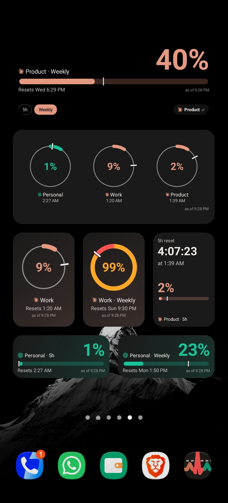<br><sub><b>Home-screen widgets</b> 🆕 — back in v1.8, mixing faces and sizes on one page</sub></td>
    <td align="center" width="33%">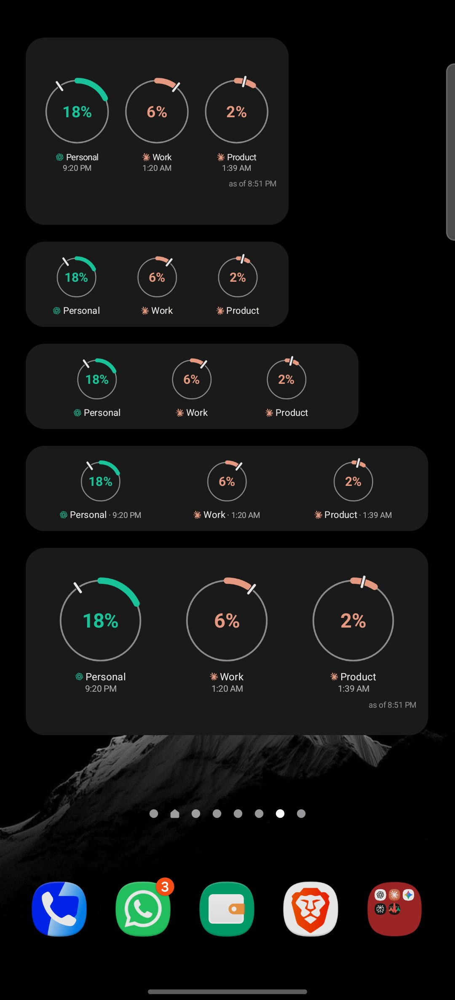<br><sub><b>All accounts</b> 🆕 — every account as its own ring, side by side</sub></td>
    <td align="center" width="33%">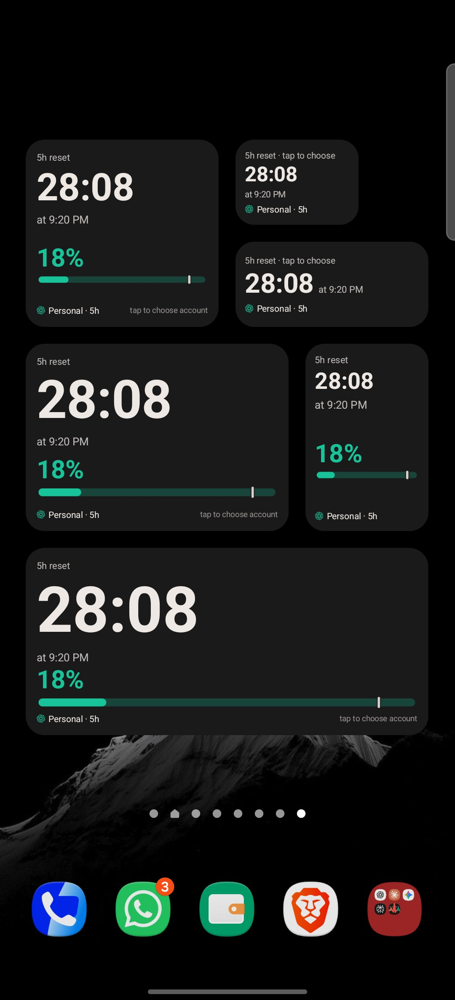<br><sub><b>Countdown</b> 🆕 — when the window comes back, at every size</sub></td>
  </tr>
  <tr>
    <td align="center" width="33%">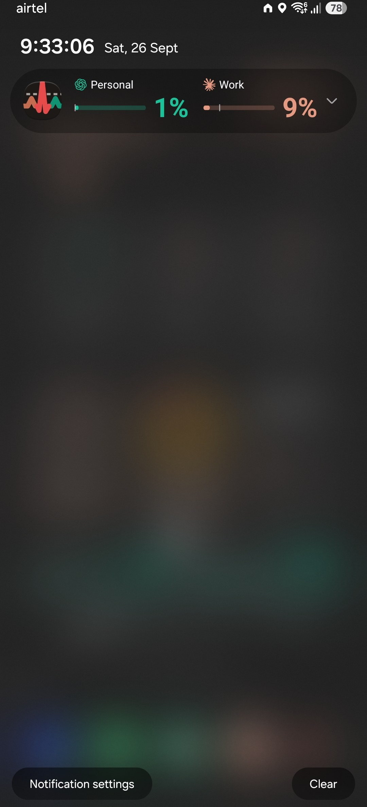<br><sub><b>The always-on notification</b> — unchanged in v1.8, now backed by a foreground service so it doesn't go stale</sub></td>
    <td align="center" width="33%">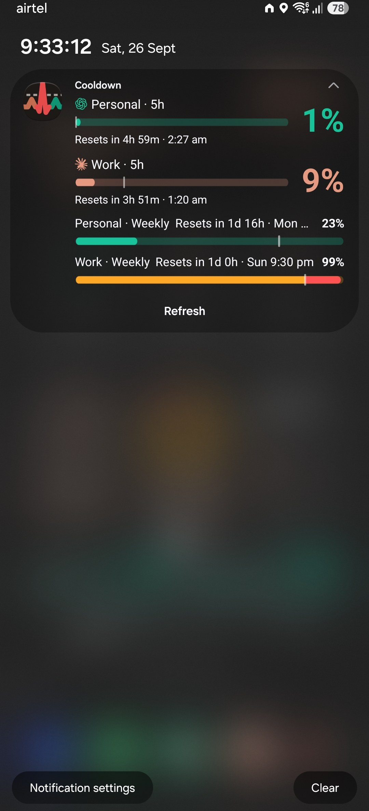<br><sub><b>Expanded</b> — both headers with reset lines, the Weekly rows, one-tap Refresh</sub></td>
    <td align="center" width="33%">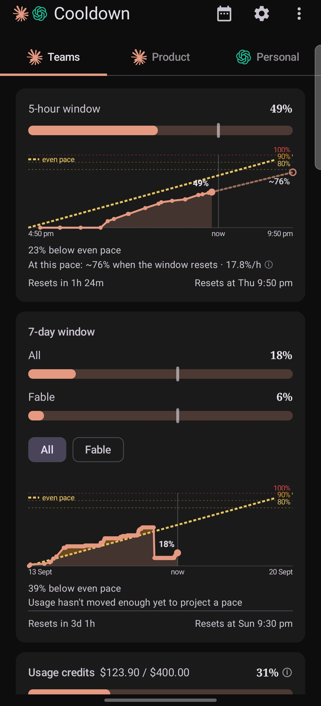<br><sub><b>The redesigned main screen</b> — Comfortable density; Claude's room now goes black in dark theme</sub></td>
  </tr>
  <tr>
    <td align="center">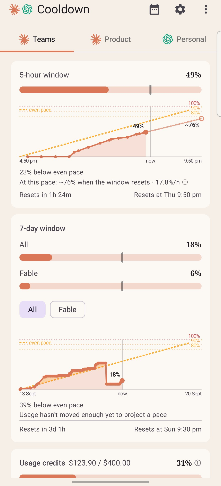<br><sub><b>Light theme</b> — the ivory room keeps its warmth; only dark went black</sub></td>
    <td align="center">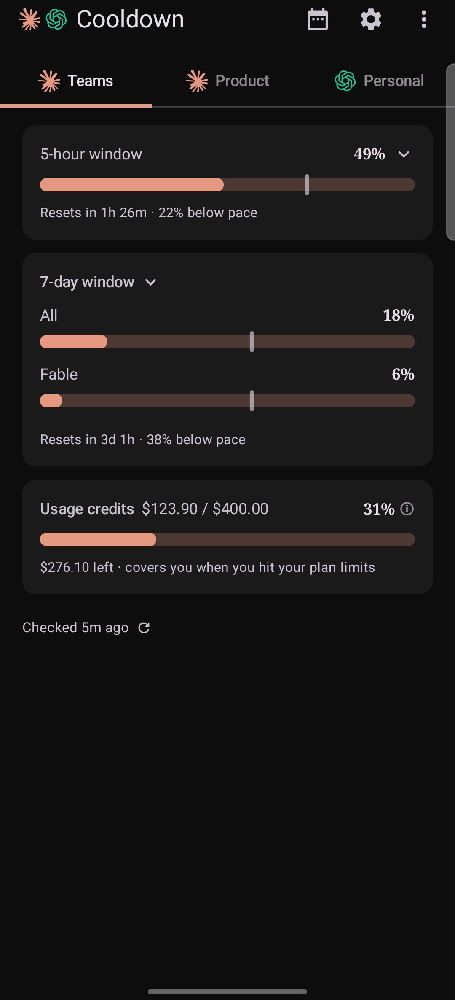<br><sub><b>Compact density</b> 🆕 — every card folds to a title, a bar and one line; tap to open the chart in place</sub></td>
    <td align="center">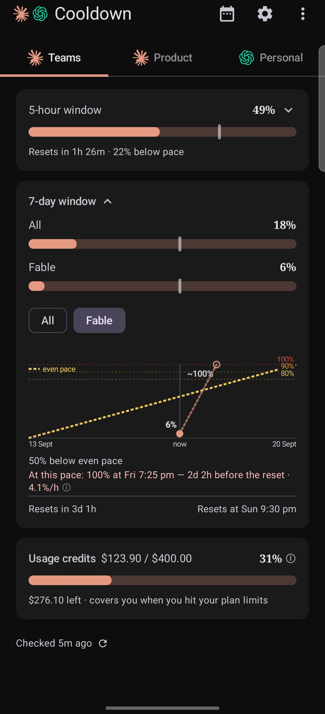<br><sub><b>All, or a model cap</b> 🆕 — the 7-day chart switches to Fable's own curve on a chip tap</sub></td>
  </tr>
  <tr>
    <td align="center">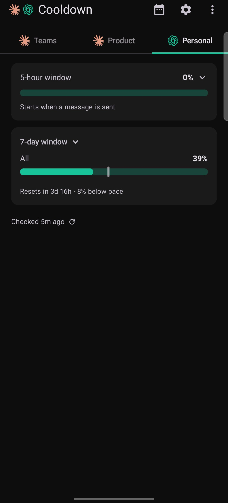<br><sub><b>Same cards, other room</b> — a ChatGPT account</sub></td>
    <td align="center">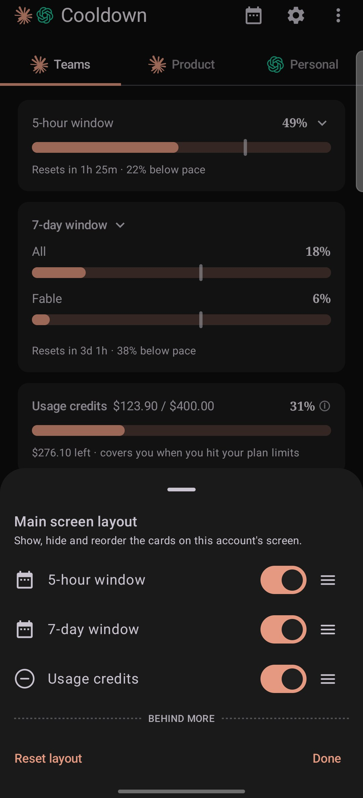<br><sub><b>Main screen layout</b> 🆕 — reorder, hide or fold cards behind "More", per account</sub></td>
    <td align="center">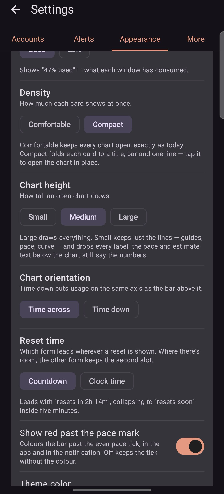<br><sub><b>Settings · Appearance</b> 🆕 — Density, Chart height and Chart orientation</sub></td>
  </tr>
  <tr>
    <td align="center">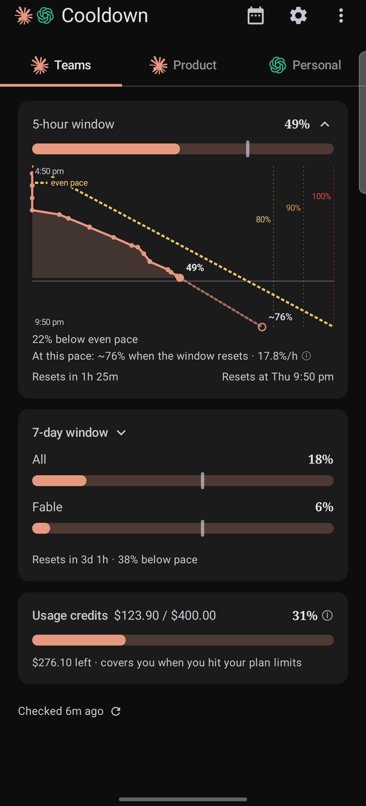<br><sub><b>Time down</b> 🆕 — the chart transposed so its curve sits directly under the bar's pace mark</sub></td>
    <td align="center">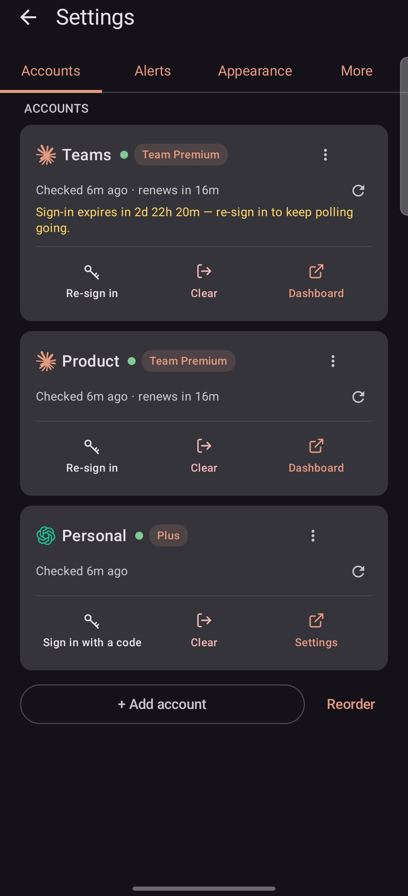<br><sub><b>Settings · Accounts</b> 🆕 — compact cards, a status line, three actions, and Reorder</sub></td>
    <td align="center">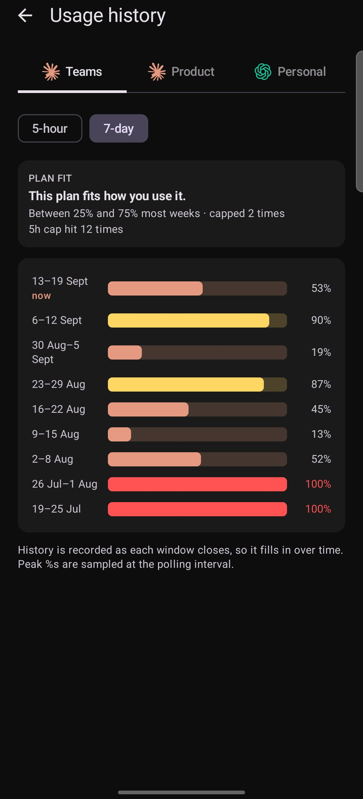<br><sub><b>Plan Fit</b> 🆕 — is this plan the right size, read off your closed weeks</sub></td>
  </tr>
</table>

<p align="center"><br><sub><b>The status-bar ring</b> — fills with the shown account's 5-hour window, in that account's own colour</sub></p>

All screenshots are from a real device (a Galaxy Z Fold 7's cover and inner screens) on the v1.8
build — the home-screen widgets, the redesigned main screen, Compact density, the layout sheet,
the transposed chart, the redesigned Accounts tab and Plan Fit are shown above and walked through
in the [PDF guide](release/docs/Cooldown-User-Guide-v1.8.pdf); the notification shots are the lock
screen, which is where it lives. **Usage history** fills in over time as your windows close.

## Get started — about 2 minutes, no computer needed

All you need is your Android phone.

**1. Install the app.** Grab the APK from the
[latest release](../../releases/latest) onto your phone and open it (allow "install
unknown apps" if your phone asks).

**2a. Sign in to Claude.** In the app: **Settings → Accounts → tap "Sign in on this phone"**
on the account card. Your browser opens Claude's sign-in — log in (Pro, Max, and Team
accounts all work), tap **Authorize**, copy the code the page shows, hop back to the app,
and tap **Paste → Finish sign-in**. Usage loads immediately — on a **Pro, Max or Team** plan. A Free
account signs in but gets no numbers: Anthropic's usage endpoint refuses it, and the card says so.

**2b. Sign in to ChatGPT.** Tap **"+ Add account" → ChatGPT**. The app shows a short code and
a countdown. Go to **auth.openai.com/codex/device** — on this phone with the **Open in
browser** button, or on your laptop, whichever is easier — type the code, and approve. The
sheet closes by itself and the new tab appears with your numbers. Nothing is copied from a
computer; the phone mints its own sign-in.

Tracking more than one account? Tap **"+ Add account"** as many times as you like and mix
the two services freely — if you keep each account logged in to claude.ai in a
different browser, the built-in browser picker lets you route each Claude sign-in accordingly
(e.g. Work in Chrome, Personal in Brave).

**Gemini?** The third row in the sheet is greyed out. Google's Antigravity sign-in can't be
completed on a phone today; the app says so rather than hiding the option.

**3. Turn on the notification.** **Settings → Alerts → Always-on notification**, then pick a
**First** and, if you like, a **Second** account under **Show accounts**. Set each account's
**5h reset** and **Weekly reset** pings to Off / If busy / Always on the same tab.

A Claude sign-in renews itself for about a month, then the app reminds you before it
lapses — re-signing in is the same one-minute flow. A ChatGPT sign-in has no fixed expiry we
can predict, so the app doesn't guess one; it tells you if a refresh ever fails.

## How it works

Each account carries which service it belongs to, and the app swaps in that service's fetcher
behind one shared interface. Everything above that — tabs, the notification, reset pings,
history — never learns the difference.

**Claude.** The app signs in with the **same OAuth client as the Claude Code CLI** — the
identical client ID and scopes (`org:create_api_key user:profile user:inference
user:sessions:claude_code user:mcp_servers user:file_upload`) — via browser-based PKCE
against `claude.com` / `platform.claude.com`. To read usage it calls an **undocumented**
endpoint (`api.anthropic.com/api/oauth/usage`), sending `User-Agent: Cooldown/<version>
(Android)` — its own name, on every host. (Through v1.6 this call borrowed the CLI's
`claude-code/<version>` on the belief that an unfamiliar client is throttled harder; that claim
was never actually tested on this endpoint, and CCRM-68 (Honest Agent) dropped it in v1.7.) The
token endpoint is the one place with a measured User-Agent rule, in the opposite direction: its
WAF 429-blocks a `claude-code` shape, so that call sends a plain library agent. Once a day it
also reads `api/oauth/profile` on the same host, which names
the organisation's plan — that is where the card's **Free / Pro / Max / Team** tag comes from, and
how a Free account is recognised: the usage endpoint answers it with **403
`oauth_not_allowed_for_organization`**, so the app stops polling usage for that account and
re-reads the profile instead until the plan changes. In short, it presents itself to Anthropic as the official CLI — see the
⚠️ install warning near the top for what that means for your account.

**ChatGPT.** Sign-in is OpenAI's **device-code flow**, the one the Codex CLI uses: the app
asks `auth.openai.com` for a short user code, you approve it in a browser anywhere, and the
app exchanges the result for its own token. It uses the **Codex CLI's client ID** — that is
the client the flow is registered for — but sends an **honest** `User-Agent:
Cooldown/<version> (Android)`, not a disguise: OpenAI's endpoint doesn't punish an unfamiliar
client the way Anthropic's does, so there's no reason to pretend. Usage comes from the
**undocumented** `chatgpt.com/backend-api/wham/usage`. The app **never** imports a token from
a desktop `auth.json` — reusing that token family would trip OpenAI's rotation detection and
sign you out of your own CLI — and it **never** calls the one nearby endpoint that would spend
a credit.

Both poll on the same battery-friendly interval (15 minutes by default, configurable). Every
poll re-renders the always-on notification; a reset ping is scheduled at the known reset
moment, and an idle account's window is rolled over on the first poll after it.

**Privacy:** your tokens stay on your device, encrypted with the Android Keystore
(EncryptedSharedPreferences, AES-256-GCM). They are sent to Anthropic's and OpenAI's APIs and
nowhere else. There are no servers, no analytics, no third-party network calls. Diagnostics
logs record status codes only — never tokens, headers or response bodies.

## Build from source

Requirements: JDK 17, Android SDK (compileSdk 36).

```bash
./gradlew assembleDebug
# APK lands in app/build/outputs/apk/debug/
```

Stack: Kotlin, Jetpack Compose (Material 3), WorkManager for polling, OkHttp. The
notification is plain RemoteViews. No other dependencies.

## Fair-use notes

- **Both** usage endpoints are undocumented (so is Anthropic's `oauth/profile`, read for the plan
  tag); the parsers are deliberately lenient and this app may break without notice if Anthropic or
  OpenAI changes a payload.
- **Free Claude plans are refused** by Anthropic's usage endpoint. The app doesn't work around
  that — it names the plan and waits for it to change.
- The app only **reads** usage data — it never sends prompts or consumes your quota
  (checking your usage does not count as usage). On the ChatGPT side it deliberately declines
  two things the endpoint would allow: the header that reserves capacity, and the call that
  spends a credit.
- The app presents the Claude Code CLI's OAuth client identity to reach Anthropic's usage
  endpoint (see [How it works](#how-it-works)); this is not sanctioned by Anthropic. Since v1.7
  it no longer borrows the CLI's User-Agent on that call (CCRM-68 (Honest Agent)). On OpenAI's
  side it uses the Codex CLI's client ID but identifies itself honestly as Cooldown; this is not
  sanctioned by OpenAI either.
- Anthropic's and OpenAI's consumer terms restrict the use of consumer OAuth tokens in
  third-party tools. Installing accepts some risk of token revocation or account flagging.
  This project exists for personal/educational use — use it at your own discretion.
- Polling is rate-limit-friendly (default 15 min, hard floor of 5 min).

## Feedback

Found a bug or want a feature? Open an issue here, or use "Share feedback" in the app's
About section (it emails <robin@eam360.com>).

## Version history

A quick, plain-English tour of what each update added (newest first). The full technical
changelog lives in the [User Guide](release/docs/Cooldown-User-Guide-v1.8.pdf).

- **1.8** — **Home-screen widgets are back, and accounts show their email.** Four widgets in
  the picker under **Cooldown** — **Ring** (one account as a gauge), **Number** (the big
  percentage), **Countdown** (when the window comes back, ticking live) and **All accounts**
  (every account as its own ring, side by side — never a sum) (CCRM-78 (Widgets Reborn),
  CCRM-79 (Ring Face), CCRM-80 (Number Face), CCRM-81 (Countdown Face), CCRM-82 (Accounts
  Strip)). Adding one opens its settings — account, window, background — changeable later from
  its long-press **Settings**; every widget **fills whatever size you place it at**, from 1×1
  to a full row, painted by the same ring renderer as the status bar (CCRM-83 (Ring Renderer),
  CCBG-44 (Widget Fill)); widgets placed before v1.6 do not return on their own. Each account
  now shows the **email** it signed in with, under its name in Settings → Accounts and first in
  ⋮ → Details, with Rename suggesting a name from it (CCBG-34 (Account Display Name));
  **Clear usage history…** starts an account's trend over without removing it (CCRM-14 (Clear
  History)). **Share snapshot**, in the main screen's ⋮, turns the ring, the bars and the 5h
  trend into one square image (CCRM-24 (Share Card)). **Fixed:** the two-account notification
  keeps both names whole with their dots (CCBG-24 (Duet Label Clamp), CCBG-37 (Duet Dot
  Squeeze)); the always-on notification no longer crashes with one account (CCBG-31 (Alert
  Crash)); the sign-in card's buttons wrap cleanly on narrow phones (CCBG-32 (Accounts Button
  Wrap)); ChatGPT sign-in names the security setting it needs (CCBG-33 (Device-Code
  Prerequisite)); each account card's ⋮ lines up with its refresh button (CCBG-42 (Kebab
  Drift)).
- **1.7** — **The main screen redesigned, the Accounts tab to match, and a notification that
  stays alive.** The main screen (CCRM-72 (Main Screen Redesign)) gets a **Compact** density
  that folds each card to a title, a bar and one line — tap to open the chart in place — plus a
  **Main screen layout** sheet to reorder, hide or fold cards behind "More" (CCRM-25 (Card
  Layout), CCRM-35 (Layout Reset)), one status line in place of the old Refresh button, a
  **Chart height** setting (Small/Medium/Large, default Medium) and a **Chart orientation**
  toggle that lines the chart's now-line up under the bar's pace mark (CCRM-75 (Chart Height),
  CCRM-77 (Transposed Chart)), the 7-day chart's own **All / per-model** chips (CCRM-73 (Model
  Cap Chart)), and Claude's dark theme going black like ChatGPT's (CCRM-76 (Black Room)). The
  **Accounts** tab is compact too — status dot, plan chip, three action cells — with
  **drag-to-reorder** accounts (CCRM-65 (Accounts Redesign), CCRM-71 (Account Order)). History's
  7-day pane gains **Plan Fit**: is this plan the right size, read off your last several closed
  weeks (CCRM-70 (Plan Fit)). The always-on notification runs as a real **foreground service**
  now, so it stops sinking below other notifications and going stale (CCRM-67 (Pin Service));
  ChatGPT's idle 5-hour window no longer counts down before it's started (CCBG-30 (Phantom
  Window)); and the app finally identifies itself honestly to Anthropic instead of borrowing the
  Claude Code CLI's name (CCRM-68 (Honest Agent)). Diagnostics moves behind the version-tap
  unlock (CCRM-34 (Diagnostics Log)). **Known issue:** CCBG-24 (Duet Label Clamp) — a long
  notification label can still clip beside a three-character figure under Left.

- **1.6** — **Two accounts on one notification, Settings on a diet, the Pulse icon.** The
  always-on notification now carries a **First** and a **Second** account side by side, with
  both headers and the Weekly rows when expanded — the expanded panel now draws at full width
  whatever it holds, so a warning strip can no longer scale the Weekly meters down with it
  (CCBG-26 (Panel Scaling)); the status-bar ring drops its weekly dot and wears the shown
  account's colour (First / Second / Whichever is higher), solid red with an × at 100%.
  **Reset pings** are per account and per window, and fire for an idle account too.
  Settings shrinks to **four tabs** — Accounts, Alerts, Appearance, More. Every Claude card
  wears its plan — **Free, Pro, Max, Team Standard, Team Premium** — read from Anthropic's
  profile endpoint (CCRM-64 (Claude Plan Tag)), and a **Free** account is told plainly that
  Claude reports no usage for it, instead of "Anthropic's server errored" (CCBG-27 (Free Plan
  403)). The **computer-token backup** (paste / Scan QR and the in-app token guide) is
  removed: signing in happens on the phone, for both services (CCRM-63 (Token Import
  Removal)). A new **Pulse** launcher icon, and each tab is a **room**: ivory and serif for
  Claude, neutral for ChatGPT. **Removed:** the home-screen widgets, the Quick Settings tile,
  the standalone threshold and pace alerts, three notification styles and three status-bar
  glyphs — placed widgets and tiles disappear on update. Fixed: the two provider marks in the
  top bar now render the same size.
- **1.5** — **ChatGPT accounts.** The app is now just **Cooldown**, and tracks Claude *and*
  ChatGPT side by side — add either from "+ Add account", sign into ChatGPT with a short code
  at auth.openai.com (no computer, no copied token), and every tab and alert works the same
  for both. Each service's own mark on every surface; a **Per provider** theme where each
  account wears its own colour, overridable per account. A window an account doesn't have is
  now hidden rather than drawn as a dash. Gemini (Google Antigravity) is listed but greyed
  out — its sign-in can't finish on a phone yet.
- **1.4** — **Multi-account** — "+ Add account" for a third, fourth, or more, each with its own tab and alerts. A new clock-hand pace needle on the always-on notification's status-bar icon. Fixed: alerts switched off in Settings now retract their pinned-notification strip instead of leaving it stuck.
- **1.3** — The status-bar icon rebuilt around its real size, with a theme-coloured pace ring and a dot for when the 7-day window needs a look; every alert for every profile now folds into one pinned-notification panel; new hourglass launcher icon; Used-or-Left and countdown-or-clock display switches.
- **1.2** — Three new widget faces (Ring, Mini-Rings, Pace — since retired); pace marks on every bar and ring; **pace alerts** on the projection, not just the percent (since retired); automatic update checks.
- **1.1** — **Usage credits**, four pinned-notification styles (three since retired), and a rebuilt **pace chart** with an even-pace line and threshold guides.
- **1.0** — First official release — everything below, polished into one build and shared with the team.
- **0.14** — Feedback now opens an email (was WhatsApp); added a **Check for updates** button; the app downloads from GitHub Releases.
- **0.13** — The big one: **usage history**, an always-on **pinned notification**, and **finer-grained alerts**. Profiles are renameable, and your history & settings now survive a reinstall.
- **0.12** — **Sign in right on your phone** — no computer needed. Also fixed a recurring sign-in error.
- **0.11** — Internal build (never released).
- **0.10** — Clearer sign-in error messages and easier token setup.
- **0.9** — **Burn-rate forecast** (when you'll hit the limit at your current pace) + sign in by scanning a QR code.
- **0.8** — Smarter heads-ups when your sign-in is about to expire or the data goes stale.
- **0.7** — Renamed to **Claude Cooldown**, new icon, tidier Settings, in-app help.
- **0.6** — Added the **Work** profile alongside Personal, plus Quick Settings tiles (since retired).
- **0.5** — Big visual refresh — cleaner bars, the pacing indicator, and 13 theme colors.
- **0.4** — First usage alerts and a Quick Settings tile.
- **0.3** — Material You theming and dark-mode polish.
- **0.2** — Bigger widget with exact reset times.
- **0.1** — First working app + widget.

## Credits

Made by **Robin Richard Rajan**.

Licensed under the [MIT License](LICENSE). See [RELEASING.md](RELEASING.md) for the
update workflow.
